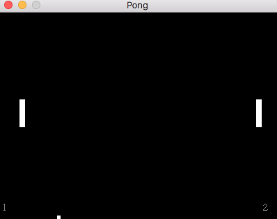
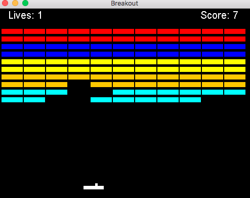

# JavaGames
Some games I made involving the java swing libraries

## Pong
-"W" and "S" key to control player left

-"UP" and "DOWN" arrow to control player right

-Score is kept on bottom right and left for each player respectively

-Runs forever (program neither pauses nor resets unless you quit and start again) 

## Breakout
-"A" and "D" key to move player 

-Press space to launch ball 

-3 lives, a life a lost if the player fails to bounce the ball

-Once all lives are lost or you have scored the max, score is shown and option to reset game is provided as a button

